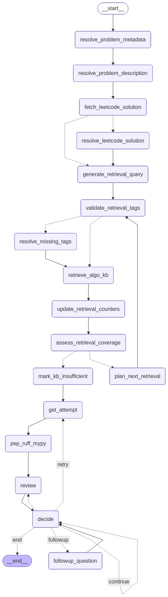

# Coding Coach — LangGraph Agentic Application

An agentic coding coach designed to help users learn problem-solving and programming through an interactive, human-in-the-loop workflow.



## The system guides users through a structured learning loop:
1. The user submits a coding problem or prompt
2. The agent analyzes the problem and retrieves relevant context
3. The user submits their own solution
4. The agent provides targeted feedback, hints, and analysis
5. The user decides how to proceed (ask questions, revise, explore alternatives)

---

## What it does

1. **Understands the problem**
    - Parses the user’s problem title
    - Extracts a structured problem description (summary, tags, constraints)

2. **(Optional) Pulls a reference solution**
    - If the prompt is a LeetCode ID/title, fetches a Python solution and analyzes it

3. **Retrieves knowledge (RAG)**
    - Generates a retrieval query + tags
    - Validates tags against a known vocabulary (fuzzy resolution when missing)
    - Retrieves relevant algorithm “KB cards” from a local Chroma store
    - Assesses whether more retrieval is needed and optionally loops

4. **Human-in-the-loop attempt**
    - Prompts user to paste a Python attempt + notes
    - Stores attempts in state

5. **Tooling feedback**
    - Runs `ruff check` + `ruff format --diff`
    - Runs `mypy`
    - Retrieves PEP 8/257 excerpts relevant to the findings

6. **Coaching output**
    - Produces structured feedback following a hint ladder:
   
        - Levels 0–2 (Conceptual Guidance)
        High-level reasoning only. No executable code or pseudocode is provided. Feedback focuses on strategy, invariants, and constraints to guide the user’s thinking without revealing implementation details.

        - Level 3 (Algorithmic Structure): Provides pseudocode to illustrate control flow and logic at an abstract level, without using any concrete programming language or runnable code.

        - Level 4 (Partial Implementation): Supplies a minimal code skeleton or patch demonstrating a key implementation detail. The snippet is intentionally incomplete and non–end-to-end to preserve user-driven problem solving.

        - Level 5 (Full Solution): Delivers a complete, working implementation along with an explanation of correctness, time and space complexity, and relevant edge cases.

7. **Feedback loop**
    - Prompts user to input an action
        - /done ends the loop.
            - Directs to END
        - /answer bumps hint level to 5 and forces a review.
            - Directs to review node (Coaching Output)
        - /retry allows user to re-enter solution.
            - Directs to attempt ndoe (Human-in-the-loop attempt)
        - /hint N changes the hint level to N
            - Directs back to itself
        - Anything else will be treated as a question
            - Directs to followup question node

8. **Followup question**
    - Determines the type of intent the question is
        - correctness
            - The user is asking whether the solution produces the right answer for all valid inputs, and/or why it fails.
        - efficiency
            - The user is asking about performance: time/space complexity, bottlenecks, and algorithm choice.
        - style
            - The user is asking about code quality/readability/idioms (especially Python), independent of whether it passes.
        - meta
            - The user is asking about the review process or your previous feedback, or the question is unclear / not about the code itself.

9. **Solution Ingestion (When there is an existing solution)**
    - If a known solution is present, distill it into reusable knowledge chunks
    - Chunks are algorithmic patterns with title, tags, complexity, pitfalls, and snippets
    - Problem title fields are redacted before prompting to avoid leakage into chunk titles
    - Inserts the resulting documents into the persistent Chroma knowledge base for future retrieval
---

## LangGraph Architecture

### High-level flow

- **Problem setup**
    - `resolve_problem_metadata`
    - `resolve_problem_description`
    - `fetch_leetcode_solution` (optional)
    - `resolve_leetcode_solution` (optional)

- **Retrieval loop**
    - `generate_retrieval_query`
    - `validate_retrieval_tags`
    - `resolve_missing_tags` (conditional)
    - `retrieve_algo_kb`
    - `update_retrieval_counters`
    - `assess_retrieval_coverage`
    - `plan_next_retrieval` (conditional loop)
    - `mark_kb_insufficient`

- **Interactive coaching loop**
    - `get_attempt` (interrupt)
    - `pep_ruff_mypy`
    - `review`
    - `decide` (interrupt)
    - `followup_question` (conditional)
    - loop until `/done`

- **Solution Ingestion (Optional - When there is existing solution)**
    - `solution_knowledge_ingest`

## Current data used
### Vector Store
- Persistent Chroma db
    - Populated with algorithms from ```thealgorithms-python```
        - Each algorithm is stored as a structured knowledge document containing:
            - Title
            - Type (algorithm, data_structure, python_template, note)
            - Summary
            - When to use
            - When not to use
            - Key ideas
            - Prerequisites
            - Time and space complexity
            - Common pitfalls
            - Pseudocode (language-agnostic)
            - Minimal Python snippet (when applicable)
            - Tags (topic-based and conceptual)
            - Source platform and source URL (when available)
        - Embedded as rich text for semantic similarity search
        - Include boolean tag flags to support tag-based queries
    - Updated at the end of each run with knowledge chunks (document) when an existing solution is present
- In-Memory Vector Store
    - Populated with ```PEP8``` and ```PEP257``` documents
        - Source HTML is parsed and segmented into semantically meaningful sections based on document headers (h1–h3)
        - Each section is stored as an individual document containing:
            - Header path (hierarchical context of the section)
            - Section text content
            - Source URL with anchor linking back to the original PEP section
            - Document type identifier (`base_best_practices`)
        - Section content is prefixed with header path to preserve structural context in embeddings
        - Documents are further chunked into overlapping text segments for retrieval stability
        - All chunks are embedded and stored in an in-memory vector store
        - The contents of this in-memory vector store is pickled and restored at application start
        - Reason for not storing into persistent memory: PEP acts as a static reference material and not any user or run specific data
---

## Repo Layout

```text
coding-coach/
├─ chroma_cache/            # cached in-memory PEP vector store
├─ chroma_db/               # persisted Chroma collection
├─ helpers/                 # tool helpers (linting, pep retrieval, tags, leetcode fetch)
├─ kb/                      # algorithm cards / source data (optional)
├─ nodes/                   # LangGraph nodes (if decomposed into modules)
├─ tools/                   # one-off scripts (e.g., render graph)
├─ utils/                   # shared utilities
├─ __init__.py
├─ app.py
├─ cli.py                   # CLI runner (interrupt/resume loop)
├─ graph.py                 # build_graph() (LangGraph wiring)
├─ resources.py
├─ state_access.py
├─ state_models.py
├─ README.md
└─ .gitignore
```

---

## Requirements

### Runtime
- Python 3.10 recommended
- Ollama installed and running locally

### External tools (subprocess)
- `ruff`
- `mypy`

### Python dependencies
Install via:
```bash
pip install -r requirements.txt
```
### Configuration Environment variables:
```text
OLLAMA_CHAT_MODEL
default: qwen2.5-coder:14b-instruct-q4_K_S

OLLAMA_EMBED_MODEL
default: nomic-embed-text
```
Example:
```bash
$env:OLLAMA_CHAT_MODEL="qwen2.5-coder:14b-instruct-q4_K_S"
$env:OLLAMA_EMBED_MODEL="nomic-embed-text"
```
### Start the application (CLI)
Run (CLI) from repo root:
```bash
python .\cli.py
```
Run (CLI) with debug logging from repo root:
```bash
python .\cli.py --debug
```
### Commands during a session
- /hint N, set hint level (0–5)
- /retry, re-enter your attempt
- /answer, jump to full-solution mode (hint level 5)
- /done, end session

---
## Possible Future Improvements
- Wider platform coverage (currently only LeetCode)
- Improve feedback by using the user's previous solutions and questions to compare changes and highlight progress
- Improve feedback by referencing previously submitted solutions
- Improve RAG hit rates
- Implement generation of an optimal solution when no model solution is provided